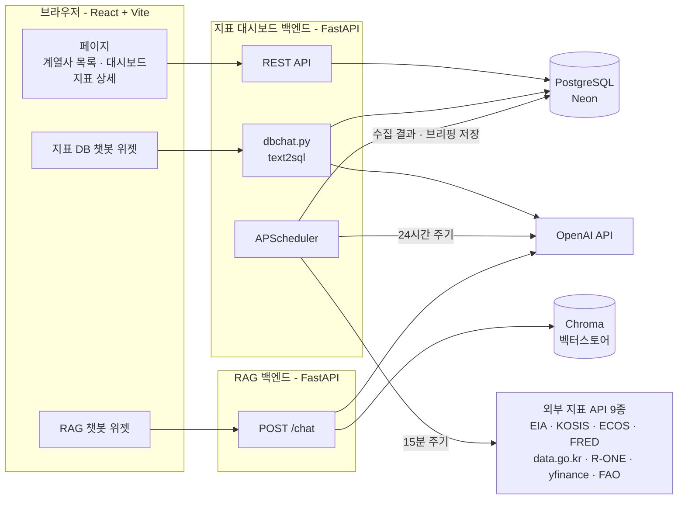
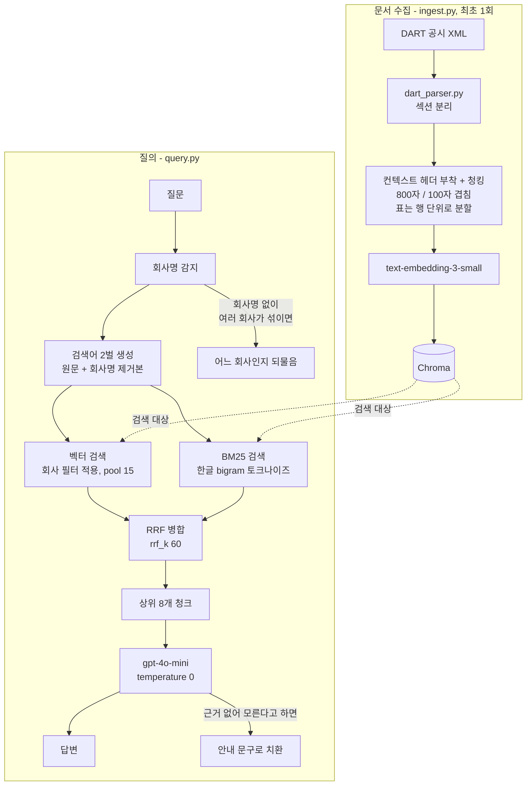
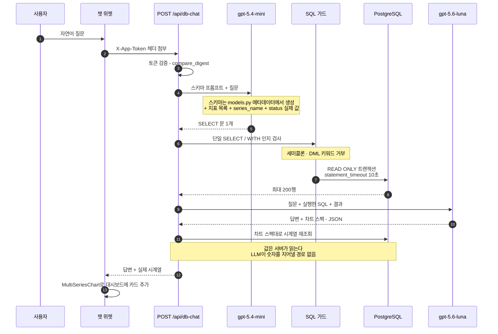

# 식품 매출 분석 웹사이트 (LLM 챗봇 연동)

매출 데이터와 경제 지표의 상관관계를 분석하고, LLM 챗봇을 통해 인사이트를 제공하는 웹사이트 프로젝트입니다.
지표는 삼양그룹 계열사(화학/식품/패키징/의약바이오/코스메틱/IT)와 관련된 원자재·환율·금리·소비 지표를
대상으로 합니다.

---

## 아키텍처

### 전체 구성

프론트엔드 하나에 백엔드가 둘입니다. 지표 대시보드 백엔드는 PostgreSQL(Neon)을,
RAG 백엔드는 Chroma 벡터스토어를 각각 들고 있고 서로 데이터를 공유하지 않습니다.
챗봇 위젯도 이 둘에 각각 하나씩 붙습니다.



### RAG 챗봇 (공시 문서 기반)

DART 공시 XML을 청크로 쪼개 Chroma에 넣어두고, 질문이 오면 **벡터 검색과 BM25 키워드 검색을
따로 돌려 RRF로 합칩니다.** 의미 검색만으로는 "매출실적" 같은 정확한 용어를, 키워드 검색만으로는
문맥을 놓치기 때문입니다.



### 지표 DB 챗봇 (text2sql + 차트 생성)

자연어를 **읽기 전용 SQL 한 문장**으로 바꿔 실행합니다. 차트를 그릴 때도 LLM은 "무엇을 그릴지"
스펙만 내고 **값은 서버가 DB에서 다시 읽습니다** — LLM이 숫자를 지어낼 경로를 없애기 위해서입니다.
단계마다 다른 모델을 씁니다. SQL 생성은 체급을 올려도 결과가 같아서 싼 모델로 내렸고,
결과를 문장으로 옮기는 단계만 상위 모델을 씁니다.



계열사와 지표를 잇는 유일한 DB 컬럼은 `correlations` 테이블입니다. 다만 이 상관계수는 관계의
증거가 아니라서(표본이 분기 18~26개뿐이라 귀무 기준선 미달), `level_r`과 함께 `trend_r`·`yoy_r`·
`survived`를 저장하고 프롬프트가 인과 표현을 금지합니다.

---

## 진행 상황

| 단계 | 상태 | 내용 |
|---|---|---|
| 1. 지표 데이터 수집 (API 연동) | ✅ 완료 | `dashboard/backend` — 33개 지표를 EIA·KOSIS·data.go.kr·ECOS·FRED·R-ONE·yfinance·FAO API로 수집, PostgreSQL(Neon)에 저장 |
| 5. 웹사이트 구축 및 시각화 | ✅ 완료 | `dashboard/frontend` — 삼양그룹 계열사 목록 첫 화면 + 계열사별 관련 지표·사업보고서 요약·AI 브리핑 + 인터랙티브 차트 (React + Recharts) |
| 2. 매출/주가 vs 지표 상관관계 분석 | ✅ 완료 | `mandu/Eda` — 계열사×지표 상관계수(레벨·변화율·추세) 전 지표 대상 계산, `correlations` DB 테이블로 적재. 표본 수가 적어(분기 18~26개) 통계적 유의성 기준은 넘지 못함 — 참고용 지표로만 노출 |
| 3. 보고서 기반 지표 키워드 추출 (RAG) | ✅ 완료 | DART 공시 문서 기반 RAG 챗봇(`RAG_project`)은 완료·연동됨. 다만 "보고서에서 매출 연관 키워드 자동 추출 → 4단계에 반영" 파이프라인 자체는 미착수 |
| 4. 매출 요인 지표 도출 | 🟡 진행 중 | `correlations` 테이블이 계열사↔지표를 잇는 DB 컬럼 역할을 하며, DB 조회 챗봇이 이를 근거로 답변. 다만 상관관계가 통계적으로 유의하지 않아 "핵심 지표 확정"까지는 아님 |
| 6. 고도화 (예측 모델 / LLM 분석 / 챗봇) | 🟡 진행 중 | 계열사별 AI 브리핑(관련 지표 최근 동향 LLM 요약, 24시간 캐싱) + DART 공시 RAG 챗봇 + 지표 DB를 SQL로 직접 조회해 답하고 차트를 그려주는 두 번째 챗봇(txt2sql) 완료. 예측 모델은 미착수 |

---

## 프로젝트 구조

```
Steam_Sales/
  dashboard/        지표 수집·시각화 웹앱 — 실행 방법은 dashboard/README.md 참고
    backend/          FastAPI + PostgreSQL(Neon) - 지표 API 수집 · 캐싱 · REST API
    frontend/         React(Vite) - 삼양그룹 계열사 첫 화면 + 지표 대시보드
  louis/             지표 수집 코드 실험 (오픈 API 테스트 노트북)
  mandu/             데이터 수집 실험 노트북
```

대시보드 실행 방법(PostgreSQL/Neon 연결, API 키 설정, 로컬 서버 실행 등)은
[`dashboard/README.md`](dashboard/README.md)에 정리되어 있습니다.

---

## 수집 지표 목록

수집할 지표 데이터 정리: [지표 데이터 목록](https://1drv.ms/x/c/d4bd888b59c67e62/IQCgXe4tEsSAT6giHQN0OTBmAfUwoK16H1kjB3DAgmrHt9U?e=AKHhk0)

실제로 수집·시각화까지 구현된 지표 목록은 `dashboard/backend/app/registry.py`에서 확인할 수 있습니다
(에너지·원자재, 농축수산물, 금융시장, 금리·통화정책, 물가·고용, 소비·유통, 부동산, 자동차, 무역·수출 등
9개 카테고리, 33개 지표).

---

## 프로젝트 로드맵

### 1단계: 지표 데이터 수집 (API 연동) ✅ 완료

- 수집 주기: 일/월/분기/연 단위 (지표별 상이)
- 수집 기간: 지표별 5~6년치
- 업데이트 주기: 조회 시점 기준 TTL 캐싱 (일별 지표 6시간, 그 외 24시간), 새로고침 버튼으로 즉시 재수집 가능

> FastAPI 백엔드가 지표별 원본 API를 호출해 정규화된 시계열로 변환하고, PostgreSQL(Neon)에 저장하는
> 파이프라인을 구축했습니다.

---

### 2단계: 매출/주가 vs 지표 상관관계 분석 ✅ 완료

- 매출 데이터 및 주가 흐름과 각 지표의 움직임을 비교
- 상관관계 분석을 통해 유의미한 지표 탐색

> 계열사×지표 조합별로 레벨·전년동기대비(YoY)·추세 상관계수를 계산해 `mandu/Eda`에 정리하고,
> 결과를 `correlations` 테이블(계열사·지표·시리즈 키, 707건)로 DB에 적재했습니다. 다만 표본이
> 분기 18~26개로 적어 대부분 **귀무 기준선을 넘지 못했습니다** — 그래서 상관계수를 그대로 "유의미한
> 지표"로 쓰지 않고, 검증 통과 여부(`survived`) 컬럼을 함께 저장해 챗봇이 답할 때도 "통계적으로
> 확인된 관계는 아니다"라는 단서를 붙이도록 강제했습니다.

---

### 3단계: 보고서 기반 지표 키워드 추출 (RAG) ✅ 완료

- 기업 보고서에서 매출과 연관된 지표 키워드를 자동 추출
- RAG(Retrieval-Augmented Generation) 기법 활용

> DART 공시 문서를 벡터DB로 색인하고 질의응답하는 RAG 챗봇(`RAG_project`)은 완료해 대시보드에
> 위젯으로 연동했습니다. 다만 이 단계가 원래 의도한 "보고서에서 지표 키워드를 자동 추출해 4단계에
> 반영"하는 파이프라인 자체는 아직 만들지 않았고, 현재는 사람이 직접 질문하면 답하는 챗봇으로만
> 쓰이고 있습니다.

---

### 4단계: 매출 요인 지표 도출 🟡 진행 중

- 2단계(상관관계)와 3단계(보고서 키워드)를 결합
- 실제 매출에 영향을 미치는 핵심 지표 선별

> `correlations` 테이블이 계열사↔지표를 잇는 유일한 DB 컬럼이 되면서, DB를 직접 SQL로 조회하는
> 챗봇(6단계)이 "이 계열사와 관련 있는 지표"류의 조인 질문에 답할 수 있게 됐습니다. 다만 2단계에서
> 통계적 유의성을 확보하지 못했기 때문에, 지금 단계는 "핵심 지표를 확정"했다기보다 "계열사-지표
> 연결 구조를 만들어 둔" 상태에 가깝습니다.

---

### 5단계: 웹사이트 구축 및 시각화 ✅ 완료

- 분석 결과를 대시보드 형태로 시각화하여 웹에 배포
- 그래프, 지표 비교 차트 등 인터랙티브 UI 제공

> 삼양그룹 계열사 목록을 첫 화면으로 두고, 계열사를 선택하면 그 계열사와 가장 관련도 높은 지표
> 3개 + 사업보고서(사업의 내용·주요 원재료) 요약 + AI 브리핑이 함께 뜨는 페이지로 이동합니다.
> 차트는 shadcn 스타일의 영역(area) 차트로, 확대/축소·기간 선택(1M/3M/6M/1Y)·시리즈별 토글을
> 지원합니다. 계열사별로 어떤 지표가 관련 있는지는 업종 카테고리 기반으로 큐레이션했습니다
> (실제 매출 상관관계 기반은 아님 — 2단계 참고).

---

### 6단계: 고도화 (선택) 🟡 진행 중

- **예측 모델:** 지표 기반 매출 예측 (성능에 따라 적용 여부 결정) — 미착수
- **LLM 분석:** 자연어 기반 인사이트 자동 생성 — ✅ 완료. 계열사 페이지에 "AI 브리핑"으로 구현.
  관련 지표들의 최근 값/변화율/최고·최저 여부를 계산해 사실 목록을 만들고, 그 근거만으로 LLM이
  2~4문장 요약을 씀. 24시간 주기로 스케줄러가 갱신 (자세한 내용은
  [`dashboard/README.md`의 "AI 브리핑" 절](dashboard/README.md#ai-브리핑) 참고)
- **챗봇 (문서 기반):** 사용자가 질문하면 분석 결과를 답변하는 챗봇 기능 — ✅ 완료. `RAG_project`가
  DART 공시 문서 기반 RAG 챗봇 API를 제공하고, 대시보드 프론트 우측 하단 위젯에서 호출
- **챗봇 (DB 조회, txt2sql):** ✅ 완료. 계열사 대시보드에 두 번째 챗봇을 추가해, 질문을 읽기 전용
  SQL 한 문장으로 바꿔 지표 DB(`indicator_points`, `correlations` 등)를 직접 조회하고 그 결과만
  근거로 답변. 단일 SELECT만 허용·READ ONLY 트랜잭션·10초 타임아웃 등 안전장치를 두었고, 스키마는
  `models.py` 메타데이터에서 자동 추출해 프롬프트와 코드가 어긋나지 않도록 함
- **그래프 자동 생성:** 챗봇과 연계한 동적 차트 생성 — ✅ 완료. txt2sql 챗봇이 값 자체가 아니라
  `{indicator_id, series_name, from, to, transform}` 형태의 **차트 스펙**만 생성하고, 실제 숫자는
  서버가 DB에서 조회해 기존 차트 컴포넌트로 그림 (LLM이 브라우저에서 임의 코드를 실행하거나 값을
  지어낼 경로를 원천 차단)
